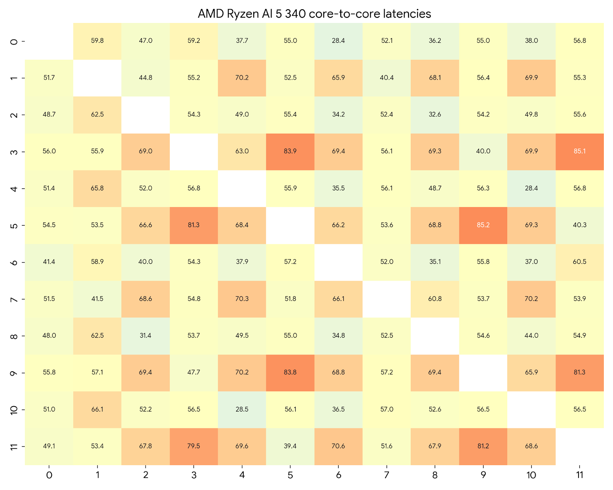
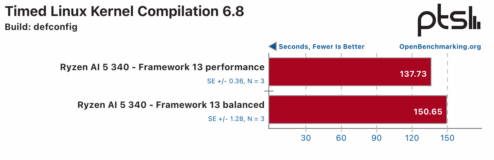

# Framework Laptop 13 AMD Ryzen AI 5 340

Device notes and configuration under Linux for the [Framework Laptop 13 AMD Ryzen AI 300 Series](https://frame.work/gb/en/laptop13?tab=specs&slug=laptop13-diy-amd-ai300) AI 5 340 variant, DIY edition.

## Specs

- [AMD Ryzen AI 5 340](https://www.amd.com/en/products/processors/laptop/ryzen/ai-300-series/amd-ryzen-ai-5-340.html) (Krackan Point, Zen 5)
- [SK hynix Platinum P41](https://ssd.skhynix.com/platinum_p41/) 1TB SSD
- [Crucial CT2K16G56C46S5](https://uk.crucial.com/memory/DDR5/CT2K16G56C46S5) 32GB DDR5-5600 SODIMM
- [BOE NE135A1M-NY1 v18.0 (matte)](https://www.panelook.com/NE135A1M-NY1_BOE_13.5_LCM_overview_66744.html) 13.5", 3:2, 2880x1920 256 ppi, 500 nits, eDP1.4, [40 pins](https://github.com/FrameworkComputer/Framework-Laptop-13/tree/025d047cf98fe63ed4de03fd18fc6c4c79880930/Display#pinout), [DC-mode dimming](https://github.com/FrameworkComputer/Framework-Laptop-13/tree/57357b797447b55ec7afcaf31b2fe731e7a48144/Mainboard#display-interface) (not PWM)
- 61Wh battery
- RZ717/MT7925 WiFi adapter
- 4x [USB-C Expansion Cards](https://frame.work/gb/en/products/usb-c-expansion-card)
- [Capella CM3218](https://github.com/FrameworkComputer/Framework-Laptop-13/blob/b3872f334810103c758e39a33572b42a5e4d67e0/Webcam/README.md#pinout) ambient light sensor

## Bugs

- [ ] Battery charge limit ignored on subsequent boots (https://github.com/FrameworkComputer/SoftwareFirmwareIssueTracker/issues/67)
- [x] amdgpu: ring vcn_unified_0 timeout [drm/amd#3926](https://gitlab.freedesktop.org/drm/amd/-/issues/3926), [mesa/mesa#12528](https://gitlab.freedesktop.org/mesa/mesa/-/issues/12528), fixed in [torvalds/linux@ee7360f](https://github.com/torvalds/linux/commit/ee7360fc27d6045510f8fe459b5649b2af27811a) (6.15)
- [x] [MT7925: mDNS and IPv6 broken in kernel 6.14.3 and above](https://lore.kernel.org/lkml/EmWnO5b-acRH1TXbGnkx41eJw654vmCR-8_xMBaPMwexCnfkvKCdlU5u19CGbaapJ3KRu-l3B-tSUhf8CCQwL0odjo6Cd5YG5lvNeB-vfdg=@pm.me/), fixed in [torvalds/linux@0aa8496](https://github.com/torvalds/linux/commit/0aa8496adda570c2005410a30df963a16643a3d) (6.15)
- [ ] [Unsupported userspace charge control](https://github.com/FrameworkComputer/SoftwareFirmwareIssueTracker/issues/70), fixed by [mfd: cros_ec: Separate charge-control probing from USB-PD](https://patchwork.kernel.org/project/chrome-platform/patch/20250521-cros-ec-mfd-chctl-probe-v1-1-6ebfe3a6efa7@weissschuh.net/)
- [ ] MT7925 `mt7925e 0000:c0:00.0: driver own failed`, fixed in [20250526152947a](https://git.kernel.org/pub/scm/linux/kernel/git/firmware/linux-firmware.git/commit/mediatek/mt7925?id=a1971ffc61d550d86d1498c9ae16f99a0243a626) 

## Sleep

Slept for 7.68 hours. Used 4.10Wh, an average rate of 0.53W (via [batterylog](https://github.com/lhl/batterylog))

## Battery

Test environment

- 6.14.0 #1-NixOS
- GNOME 47
  - `gnome-shell --no-x11` (XWayland disabled)
  - `gdm3`
  - `gnome-settings-daemon`
  - variable refresh rate
- 40% brightness
- WiFi connected
- Bluetooth disabled
- webcam and microphone disabled (via hardware switches)
- keyboard backlight disabled
- power button LED lowest brightness
- ambient light sensor disabled (`hid_sensor_hub`)
- 4x USB-C expansion cards

```sh
powerstat -d 0 -c -H 1 480
```

### Idle benchmarks

One `foot` terminal running `powerstat`

#### 2025-04-24

| State                                                                                                | C3%    | Power (W) |
| ---------------------------------------------------------------------------------------------------- | ------ | --------- |
| [idle 60Hz (ppd balanced)](./data/nixos-linux-6.14.0-gnome-47-ppd-0.30-vrr-60hz-balanced-idle.txt)   | 99.47% | 4.08      |
| [idle 120Hz (ppd balanced)](./data/nixos-linux-6.14.0-gnome-47-ppd-0.30-vrr-120hz-balanced-idle.txt) | 99.68% | 4.00      |

#### 2025-04-26

- NixOS 6.14.3
- power-saver with [panel-power-savings](https://gitlab.freedesktop.org/upower/power-profiles-daemon/-/blob/ea0d7504a8b9ec4378cd17db3386efc761195dae/README.md#panel-power-savings) and [AMDGPU Dynamic power management](https://gitlab.freedesktop.org/upower/power-profiles-daemon/-/blob/ea0d7504a8b9ec4378cd17db3386efc761195dae/README.md#amdgpu-dynamic-power-management)
- power button LED off (`ectool led power off`)
- other baseline settings [as above](#battery)

| State                                                                                                                                               | C3%    | Power (W) |
| --------------------------------------------------------------------------------------------------------------------------------------------------- | ------ | --------- |
| [idle 60Hz (ppd power-saver)](./data/nixos-linux-6.14.3-gnome-47-ppd-0.30-vrr-60hz-power-saver-idle.txt)                                            | 99.52% | 3.83      |
| [idle 60Hz (ppd power-saver) no WiFi](./data/nixos-linux-6.14.3-gnome-47-ppd-0.30-vrr-60hz-power-saver-idle-no-wifi.txt)                            | 99.58% | 3.72      |
| [idle 60Hz (ppd power-saver) no WiFi 0% brightness](./data/nixos-linux-6.14.3-gnome-47-ppd-0.30-vrr-60hz-power-saver-idle-no-wifi-0-brightness.txt) | 99.58% | 2.96      |

### Video benchmarks

- One `foot` terminal running `powerstat`
- mpv/Firefox (in Wayland mode with hardware-video acceleration) playing 1080p AV1 video
- both windows evenly split (vertically)
- other baseline settings [as above](#battery)

#### 2025-04-24

| State                                                                                                              | C3%    | Power (W) |
| ------------------------------------------------------------------------------------------------------------------ | ------ | --------- |
| [mpv 60Hz (ppd balanced)](./data/nixos-linux-6.14.0-gnome-47-ppd-0.30-vrr-60hz-balanced-mpv-av1-1080p.txt)         | 93.98% | 5.70      |
| [Firefox 60Hz (ppd balanced)](./data/nixos-linux-6.14.0-gnome-47-ppd-0.30-vrr-60hz-balanced-firefox-av1-1080p.txt) | 79.43% | 7.17      |

### Browsing benchmarks

- One `foot` terminal running `powerstat`
- Firefox, light websites (no videos)
- both windows evenly split (vertically)
- other baseline settings [as above](#battery)

#### 2025-04-24

| State                                                                                                      | C3%    | Power (W) |
| ---------------------------------------------------------------------------------------------------------- | ------ | --------- |
| [Firefox 60Hz (ppd balanced)](./data/nixos-linux-6.14.0-gnome-47-ppd-0.30-vrr-60hz-balanced-firefox.txt)   | 89.35% | 6.75      |
| [Firefox 120Hz (ppd balanced)](./data/nixos-linux-6.14.0-gnome-47-ppd-0.30-vrr-120hz-balanced-firefox.txt) | 83.55% | 7.38      |

## Core-to-Core Latency



[Data](./data/CoherencyLatency.txt) via [clamchowder/Microbenchmarks](https://github.com/clamchowder/Microbenchmarks/blob/b1e71b50a3b27c46c7ca9f91f5552451f1c5f3b0/CoherencyLatency/PThreadsCoherencyLatency.c)

## Load

Phoronix Timed Linux Kernel Compilation

### 2025-04-28

[OpenBenchmarking results](https://openbenchmarking.org/result/2504282-NE-FRAMEWORK09)



## Links

- [tlvince/nixos-config](https://github.com/tlvince/nixos-config)
- [tlvince/framework-laptop-13-amd-7640u](https://github.com/tlvince/framework-laptop-13-amd-7640u)
